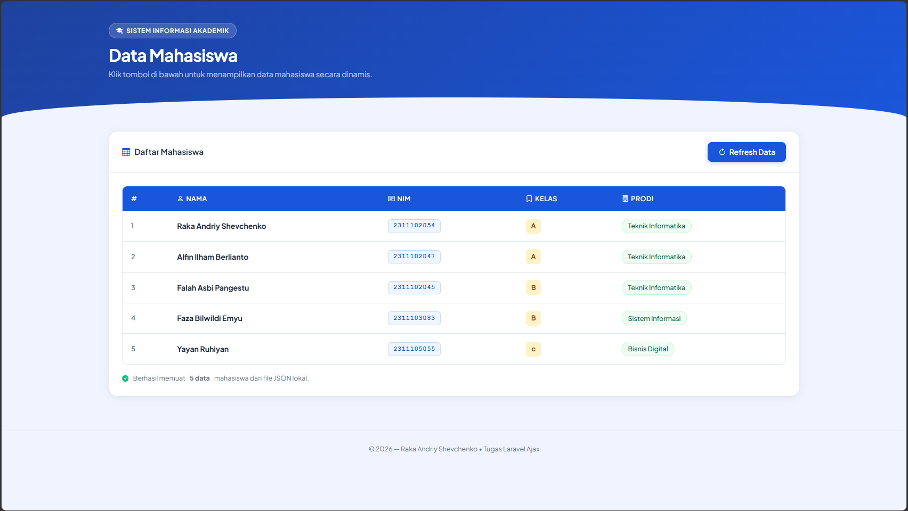

# 📋 Laporan Tugas — Aplikasi Data Mahasiswa dengan Laravel & AJAX

## Identitas

| Keterangan | Isi |
|------------|-----|
| Mata Kuliah | Pemrograman Web |
| Pertemuan | 6 |
| Nama | Raka Andriy Shevchenko |
| NIM | 2311102054 |
| Kelas | IF - 11 - 04|
| Dosen Pengampu | Cahyo Prihantoro, S.Kom., M.Eng. |
| Topik | Laravel Blade + AJAX + JSON |

---

## 📌 Deskripsi Aplikasi

Aplikasi ini adalah project Laravel sederhana yang menampilkan data mahasiswa secara dinamis menggunakan AJAX. Data mahasiswa disimpan dalam file JSON lokal (tanpa database), dibaca oleh Controller Laravel, lalu ditampilkan ke halaman web tanpa reload menggunakan JavaScript `fetch()`.

---

## 🗂️ Struktur File

```
LaravelAjax/
├── source-code/
│   ├── app/Http/Controllers/MahasiswaController.php
│   ├── routes/web.php
│   ├── resources/views/mahasiswa/index.blade.php
│   └── storage/app/mahasiswa.json
├── screenshot/
│   └── tampilan.png
└── README.md
```

---

## 📁 Penjelasan File

### 1. `mahasiswa.json` — Data Mahasiswa
File JSON yang berisi data mahasiswa secara statis (tanpa database). Disimpan di `storage/app/mahasiswa.json`.

```json
[
    {
        "nama": "Raka Andriy Shevchenko",
        "nim": "2311102054",
        "kelas": "B",
        "prodi": "Teknik Informatika"
    },
    {
        "nama": "Alfin Ilham Berlianto",
        "nim": "2311102047",
        "kelas": "B",
        "prodi": "Teknik Informatika"
    },
    {
        "nama": "Falah Asbi Pangestu",
        "nim": "2311102045",
        "kelas": "B",
        "prodi": "Teknik Informatika"
    },
    {
        "nama": "Faza Bilwildi Emyu",
        "nim": "2311103083",
        "kelas": "B",
        "prodi": "Sistem Informasi"
    },
    {
        "nama": "Yayan Ruhiyan",
        "nim": "2311105055",
        "kelas": "A",
        "prodi": "Bisnis Digital"
    }
]
```

File ini memuat minimal 4 informasi per mahasiswa: **nama**, **NIM**, **kelas**, dan **program studi**.

---

### 2. `MahasiswaController.php` — Controller
Controller Laravel yang memiliki dua method:

- **`index()`** → Mengembalikan tampilan halaman utama (`mahasiswa.index`)
- **`getData()`** → Membaca file `mahasiswa.json` menggunakan `storage_path()` dan `file_get_contents()`, lalu mengembalikannya sebagai **JSON response**

```php
public function getData()
{
    $path = storage_path('app/mahasiswa.json');
    $json = file_get_contents($path);
    $mahasiswa = json_decode($json, true);

    return response()->json([
        'success' => true,
        'data'    => $mahasiswa ?? []
    ]);
}
```

Controller **tidak menggunakan database sama sekali** — data sepenuhnya dibaca dari file JSON lokal.

---

### 3. `web.php` — Routes
Terdapat dua route yang didefinisikan:

```php
// Menampilkan halaman utama
Route::get('/', [MahasiswaController::class, 'index'])->name('mahasiswa.index');

// Endpoint AJAX untuk mengambil data JSON
Route::get('/mahasiswa/data', [MahasiswaController::class, 'getData'])->name('mahasiswa.data');
```

Route `/mahasiswa/data` inilah yang dipanggil secara AJAX dari sisi front-end.

---

### 4. `index.blade.php` — Tampilan Halaman (View)
Halaman utama dibuat menggunakan **Laravel Blade**. Komponen yang tersedia:

- **Judul halaman** — "Data Mahasiswa"
- **Tombol "Tampilkan Data"** — memicu fungsi AJAX saat diklik
- **Area hasil** — menampilkan tabel data atau pesan status (loading / kosong / error)

#### Cara Kerja AJAX
Saat tombol diklik, JavaScript memanggil `fetch()` ke endpoint `/mahasiswa/data`:

```javascript
fetch('/mahasiswa/data', {
    method: 'GET',
    headers: { 'Accept': 'application/json' }
})
.then(response => response.json())
.then(result => {
    // render data ke dalam tabel HTML
    renderTabel(result.data);
});
```

Data yang diterima kemudian dirender menjadi **tabel HTML** berisi kolom: No, Nama, NIM, Kelas, dan Prodi — **tanpa reload halaman**.

---

## 🖼️ Screenshot Tampilan



---

## 🚀 Cara Menjalankan

### Prasyarat
- PHP >= 8.1
- Composer
- Laravel 10/11/12

### Langkah Instalasi

**1. Clone repository**
```bash
git clone https://github.com/shevaws/LaravelAjax.git
cd LaravelAjax
```

**2. Install dependensi Laravel**
```bash
composer install
```

**3. Salin file environment**
```bash
cp .env.example .env
php artisan key:generate
```

**4. Pastikan file JSON ada**

Pastikan file `mahasiswa.json` berada di `storage/app/mahasiswa.json`.

**5. Jalankan server**
```bash
php artisan serve
```

**6. Buka di browser**
```
http://127.0.0.1:8000
```

**7. Klik tombol "Tampilkan Data"** — data mahasiswa akan muncul dalam tabel secara otomatis tanpa reload halaman.

---

## ✅ Checklist Ketentuan Tugas

| No | Ketentuan | Status |
|----|-----------|--------|
| 1 | Halaman utama menggunakan Laravel Blade | ✅ |
| 2 | Terdapat judul halaman | ✅ |
| 3 | Terdapat tombol Tampilkan Data | ✅ |
| 4 | Terdapat area hasil data | ✅ |
| 5 | File JSON lokal berisi minimal 3 data mahasiswa | ✅ (5 data) |
| 6 | Controller membaca file JSON dan mengembalikan JSON | ✅ |
| 7 | Data diambil menggunakan AJAX tanpa reload halaman | ✅ |
| 8 | Data ditampilkan dalam bentuk tabel | ✅ |
| 9 | Data memuat nama, NIM, kelas, prodi | ✅ |
| 10 | Tidak menggunakan database | ✅ |